# HRmanager User Guide

HRmanager is a **desktop app designed for HR managers to manage employee records, optimized for use via a Command Line Interface** (CLI) while still having the benefits of a Graphical User Interface (GUI). That is, based on typing commands instead of clicking buttons. If you can type fast, HRmanager can help you manage HR records faster than traditional GUI apps.

Managing employee records means storing and updating essential HR data: full name, phone, email, job role, department, and custom tags (e.g., “certified”, “remote”). You can add, edit, delete, search, import/export, and view statistics – all from a single command‑driven interface.

<!-- * Table of Contents -->

--------------------------------------------------------------------------------------------------------------------

## Looking to get started?

Here is a quick guide to jump straight to the section you need:

* [Quick start](#quick-start)

### Features

* [Notes about the command format](#notes-about-the-command-format)
* [Viewing help: `help`](#viewing-help-help)
* [Listing all employees: `list`](#listing-all-employees-list)
* [Adding an employee: `add`](#adding-an-employee-add)
* [Parameter restrictions](#parameter-restrictions-for-each-field)
* [Searching employees by keyword: `search`](#searching-for-employees-search)
* [Switching the statistics dashboard mode: `stat`](#switching-the-statistics-dashboard-mode-stat)
* [Editing an employee: `edit`](#editing-an-employee-edit)
* [Deleting an employee: `delete`](#deleting-an-employee-delete)
* [Clearing all entries: `clear`](#clearing-all-entries-clear)
* [Importing employee data: `import`](#import-employee-data-import)
* [Exporting employee data: `export`](#export-employee-data-export)
* [Exiting the program: `exit`](#exiting-the-program-exit)

### Other features 

* [Confirmation Prompts](#confirmation-prompts)
* [Undo an executed command: `undo`](#undo-an-executed-command-undo)
* [Cycle through command history](#cycle-through-command-history-previous-executed-commands)
* [Saving the data](#saving-the-data)
* [Editing the data file](#editing-the-data-file)

### Appendix

* [FAQ](#faq)
* [Command summary](#command-summary)

--------------------------------------------------------------------------------------------------------------------

### Conventions used
This guide uses callout boxes to help you quickly identify different types of information:

<box type="info" icon=":fa-solid-code:">

This blue box with the code mark icon provides you with example commands that demonstrate how a feature works.
</box>

<box theme="success" icon=":fa-solid-lightbulb:">

This green box with a lightbulb icon highlights helpful tips for using HRmanager more effectively.
</box>

<box type="important" icon=":fa-solid-exclamation-triangle:">

This red box with the danger icon asks you to confirm important actions before HRmanager executes them.
</box>

<box type="warning" theme="warning" icon=":fa-solid-undo-alt:">

This yellow box with a redo icon indicates that action can be undone. Use `undo` to revert the last command that changed data.
</box>


--------------------------------------------------------------------------------------------------------------------

## Quick start

1. Ensure you have Java `17` or above installed in your Computer.<br>

    **For Windows Users:**
    * Open a command terminal (press Windows Key, enter "terminal", and open the terminal app)
    * Type `java -version` and press enter.
    * Check that `java version <version number>` is Java `17` or above.<br>
    * If you do not have Java installed or if your version is below `17`, please install the precise JDK version prescribed [here](https://se-education.org/guides/tutorials/javaInstallationWindows.html).
    
    **For Mac Users:** 
    * Ensure you have the precise JDK version prescribed [here](https://se-education.org/guides/tutorials/javaInstallationMac.html).

<br>

2. Download the latest `.jar` file from [the HRmanager releases page](https://github.com/AY2526S2-CS2103T-T13-1/tp/releases).

3. Copy the file to the folder you want to use as the _home folder_ for HRmanager. Future app-related data will be generated in this folder.

4. Run the application. 
   * Open a command terminal.
   * Type `cd <HRmanager home folder>` to change the terminal directory into the folder you put the jar file in.
   * Type `java -jar HRmanager.jar` to run the application.
   * A window similar to the below should appear in a few seconds. Note how the app contains some sample data.

<br>


<br>

5. Type the command in the command box and press Enter to execute it. e.g. typing **`help`** and pressing Enter will open the help window.

   Some example commands you can try:

  * `list` : Lists all employees currently shown in HRmanager.

  * `add n/John Doe p/98765432 e/johnd@example.com r/Software Engineer d/Human Resources` : Adds an employee named `John Doe` to HRmanager.

  * `delete 3` : Deletes the 3rd employee shown in the current list.

  * `clear` : Deletes all employees.

  * `exit` : Exits the app.

6. Refer to the [Features](#features) table of contents listed above to jump each command implementation section quickly or continue scrolling for the for details of each command.

--------------------------------------------------------------------------------------------------------------------

## Features

### Notes about the command format

* Words in `UPPER_CASE` are the parameters to be supplied by the user.<br>
  e.g. in `add n/NAME`, `NAME` is a parameter which can be replaced by `John Doe`.
* Parameters in square brackets are optional.<br>
  e.g `n/NAME [t/TAG]` can be used as `n/John Doe t/junior` or as `n/John Doe`.
* Parameters with `…` after them can be used multiple times including zero times.<br>
  e.g. `[t/TAG]…` can be used as ` ` (i.e. 0 times), `t/junior`, `t/junior t/intern` etc.
* Parameters can be in any order.<br>
  e.g. if the command specifies `n/NAME p/PHONE`, `p/PHONE n/NAME` is also acceptable.
* Extraneous parameters for commands that do not take in parameters (such as `help`, `list`, `undo`, `exit` and `clear`) will be ignored.<br>
  e.g. if the command specifies `help 123`, it will be interpreted as `help`.
* If you are using a PDF version of this document, be careful when copying and pasting commands that span multiple lines, as space characters surrounding line-breaks may be omitted when copied over to the application.

--------------------------------------------------------------------------------------------------------------------

### Viewing help: `help`

Shows a dialog box with a link to the User Guide explaining how to use the app.

Format: `help`

Successful command output:

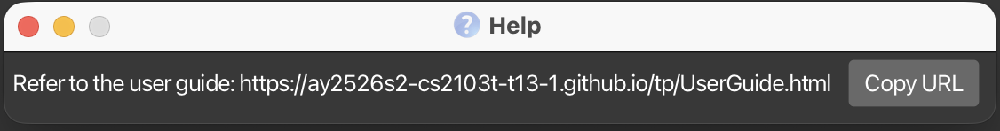

--------------------------------------------------------------------------------------------------------------------

### Listing all employees: `list`

Shows a list of all employees in HRmanager, sorted by the order they were added (most recent at the bottom) - enabling HR managers to have a complete view of their workforce.

Format: `list`

<box theme="success" icon=":fa-solid-lightbulb:">

Executing `list` returns the display to the full global employee list after any narrowed search is done.
</box>

Successful command output:

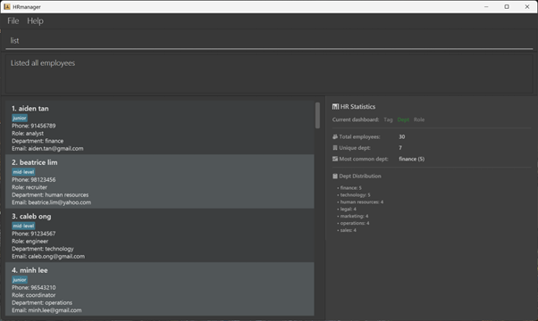

--------------------------------------------------------------------------------------------------------------------

### Adding an employee: `add`

Adds a new employee to HRmanager and stores their employee details persistently - helping HR managers track new employees along with existing employees.
* All compulsory fields (`n/`, `p/`, `e/`, `r/`, `d/`) must be provided exactly once. `t/TAG` is optional (0 or more).
* Up to 200 employees can exist in HRmanager at the same time.

Format: `add n/NAME p/PHONE e/EMAIL r/ROLE d/DEPARTMENT [t/TAG]…​`

<box type="info" icon=":fa-solid-code:">

Examples:
* `add n/John Doe p/98765432 e/johnd@example.com r/Receptionist d/Operations` adds an employee named John Doe with the specified details.
* `add n/Betsy Crowe t/junior e/betsycrowe@example.com r/Associate Director d/Finance p/1234567` adds an employee named Betsy Crowe with a tag, `junior`.
</box>

<box theme="success" icon=":fa-solid-lightbulb:">

Refer to [parameter restrictions](#parameter-restrictions-for-each-field) for acceptable values of each field.
</box>

<box type="warning" theme="warning" icon=":fa-solid-undo-alt:">

Undo Possible: This command can be reversed if executed recently. See [Undo](#undo-an-executed-command-undo) for details.
</box>

Successful command output:

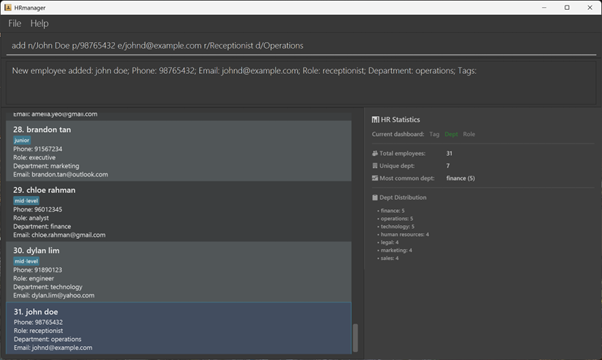

--------------------------------------------------------------------------------------------------------------------

### Parameter restrictions for each field

#### Name (`n/`)

* __Characters:__ The name should consist of only alphanumeric characters and hyphens (`-`) and spaces (` `) and cannot be blank. The name cannot have 2 consecutive hyphens or spaces in a row, or a hyphen beside a space. The name should not start or end with a hyphen. Leading and trailing spaces will be ignored. No other characters are allowed. 
* __Case sensitivity:__ The name entered is case-insensitive. For example, adding `John Doe` will be invalid if `john doe` already exists in HRmanager. Names are stored in HRmanager in lowercase. 
* __Input length:__ The name must be between 1 and 50 characters long (inclusive).

#### Phone (`p/`)

* __Characters:__ The number should consist of only numeric digits. Do not include spaces, extensions or country codes. Leading and trailing spaces will be ignored. No other characters are allowed.
* __Input length:__ The number must be between 3 and 16 digits long (inclusive).

#### Email (`e/`)

* __Characters:__ The email must follow the format local-part@domain. The local-part may contain alphanumeric characters and `+`, `_`, `.`, `-`, but cannot start or end with special characters. The domain consists of labels separated by periods (`.`); each label must start and end with alphanumeric characters, may contain hyphens (-), and the final label must be at least 2 characters long. Leading and trailing spaces will be ignored. No other characters are allowed.
* __Case sensitivity:__ The email entered is case-insensitive eg. `john.doe@example.com` will be the same as `John.Doe@Example.COM`. 
* __Input length:__ The email must be between 1 and 50 characters long (inclusive).

#### Role (`r/`)

* __Characters:__ The role should consist of only alphanumeric characters and hyphens (`-`) and spaces (` `) and cannot be blank. The role cannot have 2 consecutive hyphens or spaces in a row, or a hyphen beside a space. The role should not start or end with a hyphen. Leading and trailing spaces will be ignored. No other characters are allowed.
* __Case sensitivity:__ The role entered is case-insensitive eg. inputting `Software Engineer` will be the same as `software engineer` and `SOFTWARE ENGINEER`. The role will be stored in HRmanager in lower casing.
* __Input length:__ The role must be between 1 and 30 characters long (inclusive).

#### Department (`d/`)

* __Characters:__ The department should consist of only alphanumeric characters and hyphens (`-`) and spaces (` `) and cannot be blank. The department cannot have 2 consecutive hyphens or spaces in a row, or a hyphen beside a space. The department should not start or end with a hyphen. Leading and trailing spaces will be ignored. No other characters are allowed.
* __Case sensitivity:__ The department entered is case-insensitive eg. inputting `Human Resources` will be the same as `human resources` and `HUMAN RESOURCES`. The department will be stored in HRmanager in lower casing.
* __Input length:__ The department must be between 1 and 30 characters long (inclusive).

#### Tag (`t/`)

* __Characters:__ The tag should consist of only alphanumeric characters and hyphens (`-`) and spaces (` `) and cannot be blank. The tag cannot have 2 consecutive hyphens or spaces in a row, or a hyphen beside a space. The tag should not start or end with a hyphen. Leading and trailing spaces will be ignored. No other characters are allowed.
* __Case sensitivity:__ The tag entered is case-insensitive eg. inputting `junior` will be the same as `Junior` and `JUNIOR`. The tag will be stored in HRmanager in lower casing.
* __Input length:__ The tag must be between 1 and 30 characters long (inclusive).
* __Maximum count:__ Each employee can have at most 20 tags.

#### Index (for `edit` and `delete` commands)

* __Characters:__ The index should consist of only numeric digits.
* __Input restrictions:__ The index must be a positive integer (1, 2, 3, …​) and must be within the range of the currently displayed employee list. For example, if there are currently 5 employees shown in the list, the index must be between 1 and 5 (inclusive).
* `edit` Command: Exactly one index must be provided. The above character and input restrictions apply.
* Exception: `delete` Command accepts up to 10 distinct indexes. Duplicate indexes are removed before the command is processed. The above character and input restrictions apply to each index provided. If any index is invalid, the entire command fails (no partial deletion).

--------------------------------------------------------------------------------------------------------------------

### Searching for employees: `search`

Searches across all employee fields (name, phone, email, role, department, tags) - helping HR managers quickly locate specific employees without manually browsing through the entire list.
* Enter 1 to 5 keywords (up to 50 characters each) separated by spaces. 
* The search is case-insensitive and finds anyone matching any keyword (e.g., `John` finds John, Johnson, Johnny). 
* Special characters like `@`,`_`,`-`, and `.` are allowed.

Format: `search KEYWORD [MORE_KEYWORDS]…` (keywords are separated by a space (` `))

<box type="info" icon=":fa-solid-code:">

Examples:
* `search John` returns employees with "John" anywhere in their fields (e.g., `John Doe`).
* `search @` returns employees with `@` in any searchable field (commonly email).
* `search alice eng` returns employees that match either "alice" or "eng" (e.g., Alice who is an Engineer).
* `search zzz` shows `0 employees listed!` if no employee fields match.
</box>

<box theme="success" icon=":fa-solid-lightbulb:">

To return to the full employee list after `search`, run `list`.
</box>

Successful command output:

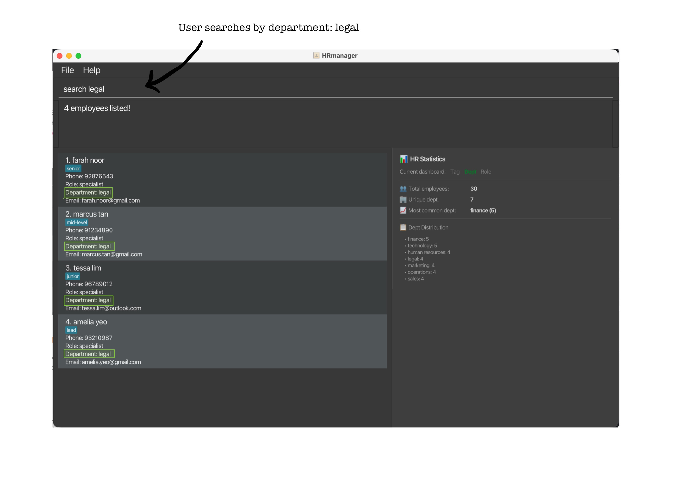

--------------------------------------------------------------------------------------------------------------------

### Switching the statistics dashboard mode: `stat`

Switches the statistics dashboard to show tags, departments, or roles distributions - providing HR managers with a breakdown of workforce composition to inform decisions on resource allocation.
* Exactly **one** mode must be provided. Mode is case-insensitive. 
* The dashboard always displays statistics for the global list, regardless of current search filters.
* By default, the dashboard starts in department mode. 
* Values are sorted by count (highest first), then alphabetically for ties.

Format: `stat MODE`

Supported modes:
* `t` or `tag` - Shows tag-focused statistics.
* `d`, `dept`, or `department` - Shows department-focused statistics.
* `r` or `role` - Shows role-focused statistics.

<box type="info" icon=":fa-solid-code:">

Examples:
* `stat t` switches the dashboard to tag distribution mode.
* `stat department` switches the dashboard to department distribution mode.
* `stat r` switches the dashboard to role distribution mode.
</box>

<box theme="success" icon=":fa-solid-lightbulb:">

The dashboard updates automatically after `add`, `edit`, `delete`, or `clear`.
</box>

Overview of Stat Panel:

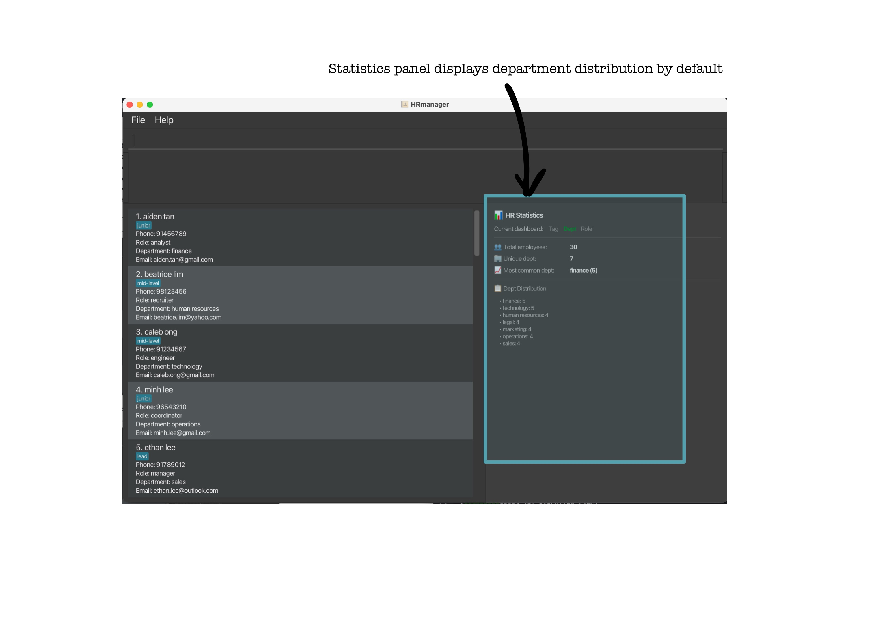

Overview of the different dashboards:

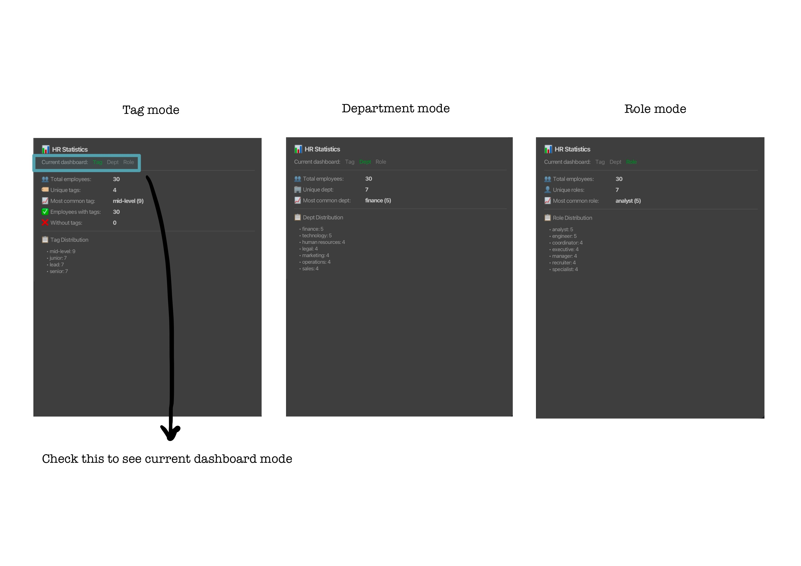

--------------------------------------------------------------------------------------------------------------------

### Editing an employee: `edit`

Edits an existing employee's details in HRmanager - enabling HR to maintain accurate and current employee information.
* At least one field must be provided. Each field (`n/`, `p/`, `e/`, `r/`, `d/`) accepts at most 1 updated value. 
* When editing tags, existing tags are replaced (not added to). To add a new tag while keeping existing ones, retype all desired tags. Use `t/` alone to clear all tags.

Format: `edit INDEX [n/NAME] [p/PHONE] [e/EMAIL] [r/ROLE] [d/DEPARTMENT] [t/TAG]…​`

<box type="info" icon=":fa-solid-code:">

Examples:
* `edit 1 p/91234567 e/johndoe@example.com` edits the 1st employee's phone to `91234567` and their email address to `johndoe@example.com`.
* `edit 2 n/Betsy Crower d/Marketing t/` edits the 2nd employee's name to `Betsy Crower` and their department to `Marketing`, and clears all of their existing tags.
* `edit 3 t/junior t/intern` changes the tags of the 3rd employee to "junior" and "intern". (If the employee already had "junior", you must retype it to keep it; otherwise, it will be replaced.)
</box>

<box theme="success" icon=":fa-solid-lightbulb:">

Refer to [parameter restrictions](#parameter-restrictions-for-each-field) for acceptable values of each field.
</box>

<box type="important" icon=":fa-solid-exclamation-triangle:">

Confirmation Required: This command requires confirmation before execution to prevent accidental edits. See [Confirmation Prompts](#confirmation-prompts) for details on how to respond.
</box>

<box type="warning" theme="warning" icon=":fa-solid-undo-alt:">

Undo Possible: This command can be reversed if executed recently. See [Undo](#undo-an-executed-command-undo) for details.
</box>

Successful command output:

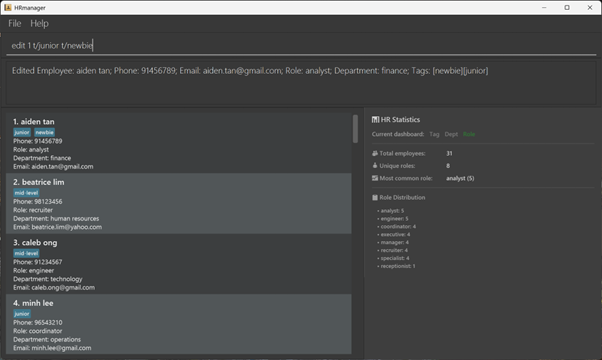

--------------------------------------------------------------------------------------------------------------------

### Deleting an employee: `delete`

Deletes one or more employees from the currently displayed list in HRmanager - enabling HR to keep the employee directory free of outdated records.

Format: `delete INDEX [MORE_INDEXES]`

Alias: `del`

<box type="info" icon=":fa-solid-code:">

Examples:
* `delete 2` deletes the 2nd employee in the currently displayed list.
* `del 4` deletes the 4th employee.
* `list` followed by `delete 1 3 5` deletes the 1st, 3rd, and 5th employees in the full list.
* `search Betsy` followed by `delete 1` deletes the 1st employee in the filtered search results.
* `delete 3 1 3` deletes the employees at indexes `3` and `1`; the repeated `3` is ignored.
</box>

<box theme="success" icon=":fa-solid-lightbulb:">

After deletion from a filtered list (i.e. after search), the view remains on the filtered list. 
</box>

<box type="important" icon=":fa-solid-exclamation-triangle:">

Confirmation Required: This command requires confirmation before execution to prevent accidental deletion. See [Confirmation Prompts](#confirmation-prompts) for details on how to respond.
</box>

<box type="warning" theme="warning" icon=":fa-solid-undo-alt:">

Undo Possible: This command can be reversed if executed recently. See [Undo](#undo-an-executed-command-undo) for details.
</box>

Successful command output:

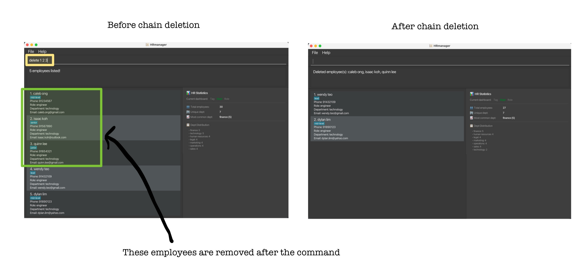

--------------------------------------------------------------------------------------------------------------------

### Clearing all entries: `clear`

Clears all employees from HRmanager - allowing HR managers to quickly remove all records before importing a new employee list or when starting fresh.

Format: `clear`

<box type="important" icon=":fa-solid-exclamation-triangle:">

Confirmation Required: This command requires confirmation before execution to prevent accidental data loss. See [Confirmation Prompts](#confirmation-prompts) for details on how to respond.
</box>

<box type="warning" theme="warning" icon=":fa-solid-undo-alt:">

Undo Possible: This command can be reversed if executed recently. See [Undo](#undo-an-executed-command-undo) for details.
</box>

--------------------------------------------------------------------------------------------------------------------

### Import employee data: `import`

Replaces all current data with employees from a CSV (comma-separated values) file - allowing HR managers to quickly load employee records from spreadsheets or migrate data from existing HR systems.
* File path must end in `.csv`.
* File must have headers `name`, `phone`, `email`, `role`, `department` (`tags` optional). If used, one `tags` column is accepted. All tags must be included in one single field, e.g. `tag1, tag2, tag3`. All data validation rules apply (e.g., no duplicate employee names, invalid or missing fields).
* In the case of duplicate headers, the leftmost column is taken.
* The file size limit is 100kB, and employee limit is 200. 
* On macOS/Linux, if the file path contains spaces, you must enclose the entire path in double quotes. Nested quotes are not supported.

Format: `import "FILE PATH"`

<box type="info" icon=":fa-solid-code:">

Examples:
* `import employees.csv`
* `import C:\Users\username\Downloads\2026_employee_list.csv` (Windows)
* `import "C:\My Documents\data.csv"` (Windows)
* `import /home/user/data.csv` (MacOS/Linux)
* `import "/home/user/My Data.csv"` (MacOs/Linux)
</box>

<box theme="success" icon=":fa-solid-lightbulb:">

Alternative ways to import:
1) Drag the file into HRmanager's home folder, then run `import filename.csv`
2) Right-click the file → "Copy as path" → paste the path (Ctrl+V) when running `import <path/that/was/copied>`
</box>

<box theme="success" icon=":fa-solid-lightbulb:">

Refer to [parameter restrictions](#parameter-restrictions-for-each-field) for acceptable values of each field.
</box>

<box theme="success" icon=":fa-solid-lightbulb:">

When errors are detected in the CSV file, the first error will be shown. Users will constantly be prompted to help with debugging until they fix all the errors.
</box>

<box type="important" icon=":fa-solid-exclamation-triangle:">

Confirmation Required: This command requires confirmation before execution to prevent accidental data loss. See [Confirmation Prompts](#confirmation-prompts) for details on how to respond.
</box>

<box type="warning" theme="warning" icon=":fa-solid-undo-alt:">

Undo Possible: This command can be reversed if executed recently. See [Undo](#undo-an-executed-command-undo) for details.
</box>

Correct csv file format:

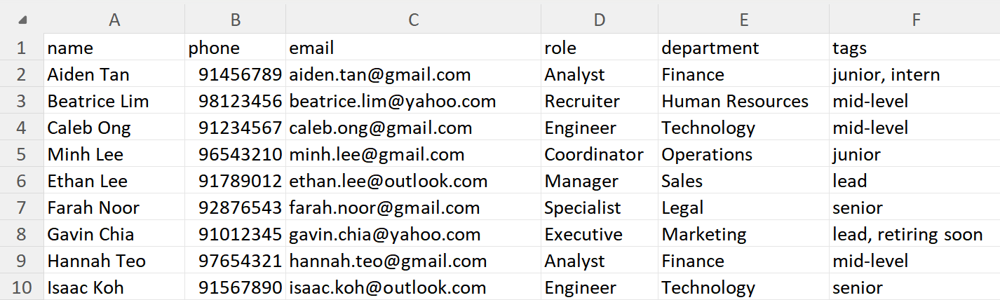

Successful command output:

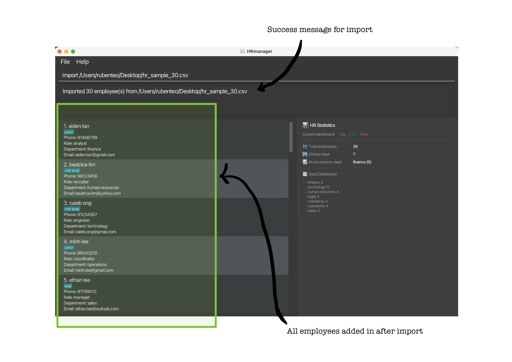

--------------------------------------------------------------------------------------------------------------------

### Export employee data: `export`

Exports all employees to a CSV (comma-separated values) file at your specified location - enabling HR managers to easily share employee records with other colleagues or for backup purposes.
* File path must end in `.csv`. 
* Use just a file name (e.g., `employees.csv`) to save in HRmanager's home folder.

Format: `export "FILE PATH"`

<box type="info" icon=":fa-solid-code:">

Examples:
* `export employees.csv`
* `export C:\Users\username\Desktop\2026_employee_list.csv` (Windows)
* `export /home/user/data.csv` (MacOS/Linux)
</box>

<box theme="success" icon=":fa-solid-lightbulb:">

The full list is exported (even if you are viewing filtered results).
</box>

<box type="important">

Overwriting existing files is **not allowed**.
</box>

Successful command output:

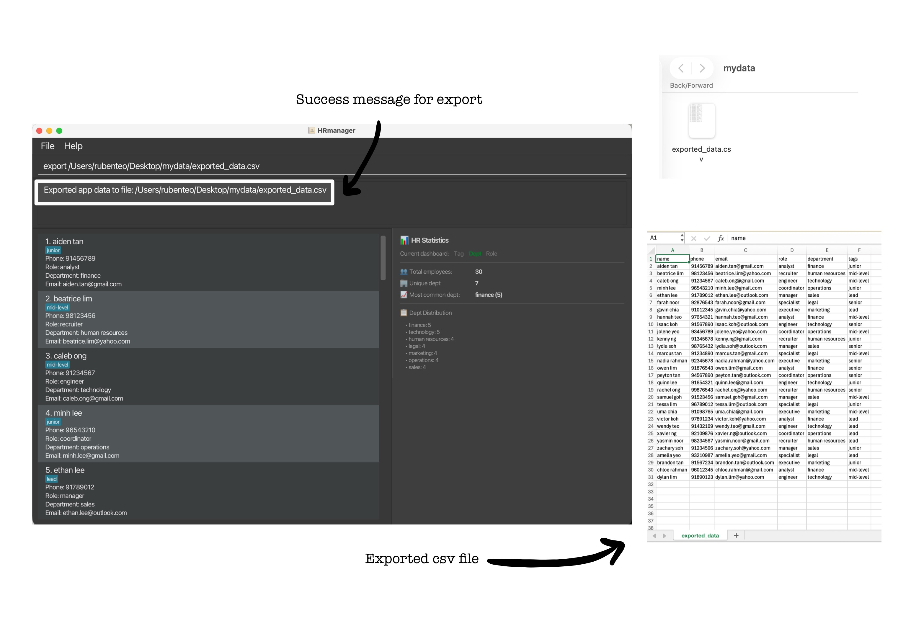

--------------------------------------------------------------------------------------------------------------------

### Exiting the program: `exit`

Closes the HRmanager application - used when HR managers are done managing employee records for the time being.

Format: `exit`

<box theme="success" icon=":fa-solid-lightbulb:">

HRmanager will automatically save all data before exiting, so there is no need to save manually.
</box>

<box type="important" icon=":fa-solid-exclamation-triangle:">

Confirmation Required: This command requires confirmation before execution. See [Confirmation Prompts](#confirmation-prompts) for details on how to respond.
</box>

--------------------------------------------------------------------------------------------------------------------

## Other features

### Confirmation Prompts

Since HRmanager stores **sensitive employee data** (personal information, contact details, role assignments, and department information), certain commands that permanently modify or delete this information require your explicit confirmation before they execute. This safety mechanism helps prevent accidental data loss or unintended changes to employee records.

**Commands that require confirmation:**
* `edit` - When editing an employee's information
* `delete` - When deleting one or more employees
* `clear` - When clearing all entries
* `exit` - When closing the application
* `import` - When importing data into the application from a file

**How confirmation works:**
1. After you enter one of the above commands, a confirmation prompt will appear displaying:
   - The action you are about to perform
   - The impact of this action
2. You must respond with either:
   - `y` - to proceed with the command
   - `n` - to cancel and discard the command
3. If you enter anything other than `y` or `n`, you will be asked to enter a valid response.

<box type="info" icon=":fa-solid-code:">

The text starting with `>` shows the command you type into HRmanager. Do not type the `>` symbol itself.
<br>The text after the // is a comment or explanation, not part of the actual command.<br>

<br>Command execution sequence example:
```
> delete 1
⚠ Warning! ⚠ Please confirm this action. Enter 'y' to proceed or 'n' to cancel.
Action: Delete 1 employee(s)
Impact: The selected employee record(s) will be permanently removed: john doe.

> y
Deleted employee(s): john doe

> edit 1 n/john doe
⚠ Warning! ⚠ Please confirm this action. Enter 'y' to proceed or 'n' to cancel.
Action: Edit employee at index 1.
Impact: Provided fields will overwrite existing employee details for: josh tan. //josh tan is the name of the employee at index 1

> n
Cancelled: edit employee details.
```
</box>

<box theme="success" icon=":fa-solid-lightbulb:">

This confirmation step is designed to prevent mistakes. If you accidentally type a command, simply enter `n` to cancel it without any changes being made to your employee data.
</box>

--------------------------------------------------------------------------------------------------------------------

### Undo an executed command: `undo`

Reverses the effects of a prior `add`, `edit`, `delete`, `clear`, or `import` command (Up to 10 commands) (Collectively: "Eligible commands").
* If you close the app and re-run it, you will lose command execution history and hence the ability to perform `undo` on those commands from previous sessions.

Format: `undo`

<box type="info" icon=":fa-solid-code:">

The text starting with `>` shows the command you type into HRmanager. Do not type the `>` symbol itself.
<br>The text after the `//` is a comment or explanation, not part of the actual command.<br>

<br>Command execution sequence example:
* `undo` can be used repeatedly: the execution sequence
```
> add (parameters...) // execute add
> edit (parameters...) // execute edit
> undo // reverses edit (more recent commands first)
> undo // reverses add
```
will not result in any net change because all the changes are reversed. Beyond 10 undos, attempting undo again will result in output that shows that there are no more commands to undo, because the oldest saved command is removed to accomodate new saved commands when there are already 10 saved commands.

* `undo` ignores ineligible commands: the execution sequence 
```
> add (parameters...) // execute add
> help 
> edit (parameters...) // execute edit
> search ronald
> list
> undo // reverses edit
> undo // reverses add
```
is effectively the same as the above example and will not result in any net change because all the changes are reversed. The `help`, `search` and `list` commands are ineligible and are ignored by the undo command.

Design considerations:
`undo` clears the filter and returns to the main view. If the filter were silently restored, users might not realize they are still in a filtered view, especially after multiple undo operations. This also maintains a single source of truth by ensuring users always return to a complete, reliable overview after undo, reducing ambiguity.

</box>

<box theme="success" icon=":fa-solid-lightbulb:">

Each previous successful eligible command is saved (up to 10 of the latest ones). You can perform `undo` repeatedly to reverse up to the 10 most recent eligible commands, in reverse order.
</box>

--------------------------------------------------------------------------------------------------------------------

### Cycle through command history (previous executed commands)

You can pre-fill the command box with your last successful commands using the **Up arrow key**. Use Up/Down arrows to browse through your last 10 successful distinct (not the exact same) commands only (excluding y/n).
* You can only cycle through commands executed in the current session. The command history resets when you restart the app.

<box type="info" icon=":fa-solid-code:">

The text starting with `>` shows the command you type into HRmanager. Do not type the `>` symbol itself.
<br>The text after the `//` is a comment or explanation, not part of the actual command.<br>

<br>Command execution sequence example:
* After adding several employees and performing a search, you want to add another employee similar to a previous one:
```
> add n/John p/98765432 e/john@example.com r/Engineer d/Engineering // Executed add command to add John Doe
> search Engineer
> add n/Jane // Incomplete command (has not been executed yet)

> (Press Up arrow once)  // Command box shows: search Engineer
> (Press Up arrow again) // Command box shows: add n/John p/98765432 e/john@example.com r/Engineer d/Engineering
> add n/Jane p/91234567 e/jane@example.com r/Engineer d/Engineering // edited from John's add command
```

* You can then modify the retrieved command (e.g., change the name from John to Jane) and press Enter to execute the new command.
* The current pending command is saved when you browse history, so typing add n/ then pressing Up arrow won't lose your partial input.

</box>


<box theme="success" icon=":fa-solid-lightbulb:">

Use this to refer to an earlier command, or to repeat a similar command with slight modifications
</box>

<box theme="success" icon=":fa-solid-lightbulb:">

The current pending command is saved when the command history is explored, so your progress on current half-written commands is not lost when you browse the command history.
</box>

--------------------------------------------------------------------------------------------------------------------

### Saving the data

HRmanager data are saved in the hard disk automatically after any command that changes the data. There is no need to save manually.

--------------------------------------------------------------------------------------------------------------------

### Editing the data file

HRmanager data are saved automatically as a JSON file `[JAR file location]/data/HRmanager.json`. Advanced users are welcome to update data directly by editing that data file. 

<box type="important">

**Caution:**
If your changes to the data file make its format invalid, HRmanager will discard all data and start with an empty data file at the next run. Hence, it is recommended to take a backup of the file before editing it.<br>
Furthermore, certain edits can cause HRmanager to behave in unexpected ways (e.g., if a value entered is outside the acceptable range). Therefore, edit the data file only if you are confident that you can update it correctly.
</box>

--------------------------------------------------------------------------------------------------------------------

## Appendix

### FAQ

**Q**: How do I transfer my data to another Computer?<br>
**A**: Use the `export` command on your current computer to save your employee data as a CSV file. Copy this CSV file to your new computer, then use the `import` command in HRmanager to load your data. This will overwrite the sample data with your own records and is the recommended way to transfer data between computers.

**Q**: How do I import multiple tags for a single employee in CSV?<br>
**A**: In the CSV file, ensure that all tags for an employee are included in a single field (e.g., `tags`) and separated by commas. For example, if an employee has the tags "junior", "intern", and "certified", the `tags` field for that employee should be formatted as `junior, intern, certified`. When you import this CSV file into HRmanager, it will correctly parse the tags and assign them to the employee.

<br>

### Command summary

Action     | Format, Examples
-----------|----------------------------------------------------------------------------------------------------------------------------------------------------------------------
**Help**   | `help`
**List**   | `list`
**Add**    | `add n/NAME p/PHONE e/EMAIL r/ROLE d/DEPARTMENT [t/TAG]…​` <br> e.g., `add n/James Ho p/87559091 e/jamesho@example.com r/Software Engineer d/Engineering t/junior t/intern`
**Search** | `search KEYWORD [MORE_KEYWORDS]...`<br> e.g., `search James @`
**Stat** | `stat MODE`<br> e.g., `stat tag`, `stat dept`, `stat role`
**Edit**   | `edit INDEX [n/NAME] [p/PHONE] [e/EMAIL] [r/ROLE] [d/DEPARTMENT] [t/TAG]…​`<br> e.g.,`edit 2 n/James Lee e/jameslee@example.com d/Finance`
**Delete** | `delete INDEX [MORE_INDEXES]` or `del INDEX [MORE_INDEXES]`<br> e.g., `delete 3`, `delete 1 4 5`
**Clear**  | `clear`
**Import** | `import [FILE PATH]`<br> e.g., `import C:\Users\John\Desktop\employees.csv`
**Export** | `export [FILE PATH]`<br> e.g., `export C:\Users\John\Desktop\employees.csv`
**Exit**   | `exit`
**Undo**   | `undo`
**Cycle commands** | up/down arrow keys
