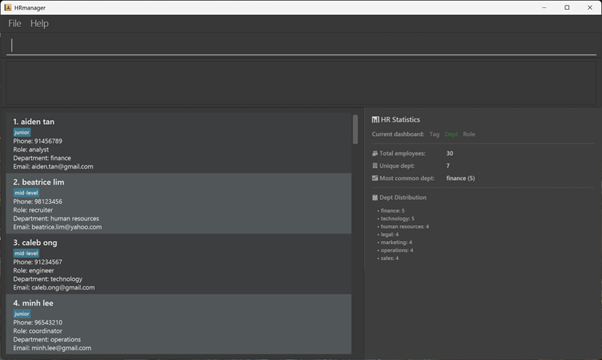

# HRmanager User Guide

HRmanager is a **desktop app for managing employee and applicant records, optimized for use via a Line Interface** (CLI) while still having the benefits of a Graphical User Interface (GUI). If you can type fast, HRmanager can help you manage HR records faster than traditional GUI apps.

<!-- * Table of Contents -->
<page-nav-print />

--------------------------------------------------------------------------------------------------------------------

## Looking to get started?

Here is a quick guide to jump straight to the section you need:

* [Quick start](#quick-start)

### Features

* [Viewing help: `help`](#viewing-help-help)
* [Listing all employees: `list`](#listing-all-employees-list)
* [Adding an employee: `add`](#adding-an-employee-add)
* [Searching employees by name: `search`](#searching-employees-by-name-search)
* [Switching the statistics dashboard mode: `stat`](#switching-the-statistics-dashboard-mode-stat)
* [Cycle through previous executed commands](#cycle-through-previous-executed-commands)
* [Editing an employee: `edit`](#editing-an-employee-edit)
* [Deleting an employee: `delete`](#deleting-an-employee-delete)
* [Clearing all entries: `clear`](#clearing-all-entries-clear)
* [Import/Export employee data: `import` or `export`](#importexport-employee-data-import-or-export)
* [Exiting the program: `exit`](#exiting-the-program-exit)

### Other sections

* [Confirmation Prompts](#confirmation-prompts)
* [Saving the data](#saving-the-data)
* [Editing the data file](#editing-the-data-file)
* [FAQ](#faq)
* [Known issues](#known-issues)
* [Command summary](#command-summary)

--------------------------------------------------------------------------------------------------------------------

## Quick start

1. Ensure you have Java `17` or above installed in your Computer.<br>
   **Mac users:** Ensure you have the precise JDK version prescribed [here](https://se-education.org/guides/tutorials/javaInstallationMac.html).

2. Download the latest `.jar` file from [the HRmanager releases page](https://github.com/AY2526S2-CS2103T-T13-1/tp/releases).

3. Copy the file to the folder you want to use as the _home folder_ for HRmanager.

4. Open a command terminal, `cd` into the folder you put the jar file in, and use the `java -jar HRmanager.jar` command to run the application.<br>
   A GUI similar to the below should appear in a few seconds. Note how the app contains some sample data.<br>
   

5. Type the command in the command box and press Enter to execute it. e.g. typing **`help`** and pressing Enter will open the help window.<br>
   Some example commands you can try:

  * `list` : Lists all employees currently shown in HRmanager.

  * `add n/John Doe p/98765432 e/johnd@example.com r/Software Engineer d/Human Resources` : Adds an employee named `John Doe` to HRmanager.

  * `delete 3` : Deletes the 3rd employee shown in the current list.

  * `clear` : Deletes all employees.

  * `exit` : Exits the app.

6. Refer to the [Features](#features) below for details of each command.

--------------------------------------------------------------------------------------------------------------------

## Features

<box type="info" seamless>

**Notes about the command format:**<br>

* Words in `UPPER_CASE` are the parameters to be supplied by the user.<br>
  e.g. in `add n/NAME`, `NAME` is a parameter which can be used as `add n/John Doe`.

* Items in square brackets are optional.<br>
  e.g `n/NAME [t/TAG]` can be used as `n/John Doe t/friend` or as `n/John Doe`.

* Items with `…`​ after them can be used multiple times including zero times.<br>
  e.g. `[t/TAG]…​` can be used as ` ` (i.e. 0 times), `t/friend`, `t/friend t/family` etc.

* Parameters can be in any order.<br>
  e.g. if the command specifies `n/NAME p/PHONE_NUMBER`, `p/PHONE_NUMBER n/NAME` is also acceptable.

* Extraneous parameters for commands that do not take in parameters (such as `help`, `list`, `exit` and `clear`) will be ignored.<br>
  e.g. if the command specifies `help 123`, it will be interpreted as `help`.

* If you are using a PDF version of this document, be careful when copying and pasting commands that span multiple lines as space characters surrounding line-breaks may be omitted when copied over to the application.
</box>

### Viewing help : `help`

Shows a message explaining how to access the help page.


Format: `help`

<br>


### Listing all employees : `list`

Shows a list of all employees in HRmanager.

Format: `list`

<br>


### Adding an employee : `add`

Adds an employee to HRmanager.

Format: `add n/NAME p/PHONE_NUMBER e/EMAIL r/ROLE d/DEPARTMENT [t/TAG]…​`

What this feature does:
* Adds a new employee persistently into HRmanager.
* Captures and stores their essential contact and job role details.

<box type="tip" seamless>

**Tip:** An employee can have any number of tags (including 0)
</box>

Additional constraints:
* The compulsory fields are `n/NAME`, `p/PHONE_NUMBER`, `e/EMAIL`, `r/ROLE`, and `d/DEPARTMENT`. Each compulsory prefix must be provided exactly once.
* `t/TAG` is optional and can be provided any number of times (including 0).
* The employee to be added cannot already exist in HRmanager (based on a case-insensitive match on the name).
* If two employees share the same real-world name, include a differentiating suffix in the name itself (for example, `John Doe Sales` and `John Doe Intern`) so that both names are unique.
* Names are normalized to lowercase when stored in HRmanager.

Examples:
* `add n/John Doe p/98765432 e/johnd@example.com r/Receptionist d/Operations` adds an employee named John Doe with the specified details.
* `add n/Betsy Crowe t/friend e/betsycrowe@example.com r/Associate Director d/Finance p/1234567 t/criminal` adds an employee named Betsy Crowe with two tags, `friend` and `criminal`.

**Successful add command output:**

> **PNG placeholder:** Insert a screenshot here, e.g. `images/add-command-placeholder.png`

<br>

### Parameter restrictions for each field:

#### Name (`n/`)

* __Characters:__ The name should consist of only alphanumeric characters and/or hyphens (`-`) and/or spaces (` `) and cannot be blank. The name should not contain consecutive hyphens or spaces. The name should not start or end with a hyphen or space. No other characters are allowed.
* __Case sensitivity:__ The name entered is case-insensitive. For example, adding `John Doe` will be invalid if `john doe` already exists in HRmanager. Names are stored in HRmanager in lowercase.
* __Input length:__ The name must be between 1 and 50 characters long (inclusive).

#### Phone (`p/`)

* __Characters:__ The number should consist of only numeric digits. Do not include spaces, extensions or country codes. No other characters are allowed.
* __Input length:__ The number must be between 3 and 16 digits long (inclusive).

#### Email (`e/`)

* __Characters:__ The email must follow the format local-part@domain. The local-part may contain alphanumeric characters and `+`, `_`, `.`, `-`, but cannot start or end with special characters. The domain consists of labels separated by periods (`.`); each label must start and end with alphanumeric characters, may contain hyphens (-), and the final label must be at least 2 characters long. No other characters are allowed.
* __Case sensitivity:__ The email entered is case-insensitive eg. `john.doe@example.com` will be the same as `John.Doe@Example.COM`. 
* __Input length:__ The email must be between 1 and 50 characters long (inclusive).

#### Role (`r/`)

* __Characters:__ The role should consist of only alphanumeric characters and/or hyphens (`-`) and/or spaces (` `) and cannot be blank. The role should not contain consecutive hyphens or spaces. The role should not start or end with a hyphen or space. No other characters are allowed.
* __Case sensitivity:__ The role entered is case-insensitive eg. inputting `Software Engineer` will be the same as `software engineer` and `SOFTWARE ENGINEER`. The role will be stored in Hr manager in lower casing.
* __Input length:__ The role must be between 1 and 30 characters long (inclusive).

#### Department (`d/`)

* __Characters:__ The department should consist of only alphanumeric characters and/or hyphens (`-`) and/or spaces (` `) and cannot be blank. The department should not contain consecutive hyphens or spaces. The department should not start or end with a hyphen or space. No other characters are allowed.
* __Case sensitivity:__ The department entered is case-insensitive eg. inputting `Human Resources` will be the same as `human resources` and `HUMAN RESOURCES`. The department will be stored in Hr manager in lower casing.
* __Input length:__ The department must be between 1 and 30 characters long (inclusive).

#### Tag (`t/`)

* __Characters:__ The tag should consist of only alphanumeric characters and/or hyphens (`-`) and/or spaces (` `) and cannot be blank. The tag should not contain consecutive hyphens or spaces. The tag should not start or end with a hyphen or space. No other characters are allowed.
* __Case sensitivity:__ The tag entered is case-insensitive eg. inputting `friend` will be the same as `Friend` and `FRIEND`. The tag will be stored in Hr manager in lower casing.
* __Input length:__ The tag must be between 1 and 30 characters long (inclusive).

<br>


### Searching for an employee : `search`

Finds employees whose fields contain all of the given keywords.

Format: `search KEYWORD [MORE_KEYWORDS]...` (each keyword separated by a space)

What this feature does:
* Filters the employee list to show only those who match all provided keywords.
* Searches across every field (name, phone, email, role, department, and tags).
* Evaluates partial matches (e.g., `Han` will match `Hans`).

Additional constraints:
* The search is case-insensitive.
* At least **one** keyword must be provided.
* A maximum of **5** keywords can be supplied in a single command.
* Each keyword must be **alphanumeric** only (no spaces or special characters).
* Each keyword must be at most **20** characters long.

Examples:
* `search John` returns employees with "John" anywhere in their fields (e.g., `John Doe`).
* `search friends` returns employees with the "friends" tag or keyword.
* `search alice eng` returns employees that match both "alice" and "eng" (e.g., Alice who is an Engineer).
* `search zzz` shows `0 employees listed!` if no employee fields match.

**Successful search command output:**

> **PNG placeholder:** Insert a screenshot here, e.g. `images/search-command-placeholder.png`

<br>


### Switching the statistics dashboard mode: `stat`

Switches the right-side HR statistics dashboard to a selected mode so you can focus on the metric that matters now.

Format: `stat MODE`

What this feature does:
* Changes the dashboard between **tag**, **department**, and **role** distributions.
* Gives an at-a-glance view of workforce composition by showing total employees and grouped distribution trends.
* Helps HR quickly see which tags, departments, and roles exist, so they can search and manage records more efficiently.
* Uses the full employee records in HRmanager for dashboard computation.
* Shows organisation-wide metrics based on the full employee dataset, even when the on-screen list is filtered (for example after `search`).

Supported modes:
* `t` or `tag` - Shows tag-focused statistics.
* `d`, `dept`, or `department` - Shows department-focused statistics.
* `r` or `role` - Shows role-focused statistics.

<box type="info" seamless>

**Mode-specific display behavior:**
* All modes show total employees.
* **Tag mode:** Unique tags, most common tag, employees with tags, employees without tags, and tag distribution.
* **Department mode:** Unique departments, most common department, and department distribution.
* **Role mode:** Unique roles, most common role, and role distribution.
* For all modes, distribution values are shown top-to-bottom in descending count (highest at the top, lowest at the bottom).
* If multiple values have the same count, they are ordered alphabetically (case-insensitive).
* For all modes, values are computed from the full HRmanager dataset (global distribution), not only the currently filtered on-screen list.
</box>

Additional constraints:
* Exactly **one** mode must be provided.
* The mode is case-insensitive.
* If the input format is invalid, HRmanager shows the `stat` command usage message.

Examples:
* `stat t` switches the dashboard to tag distribution mode.
* `stat department` switches the dashboard to department distribution mode.
* `stat r` switches the dashboard to role distribution mode.

**Tag mode dashboard (`stat t` or `stat tag`):**

> **PNG placeholder:** Insert a screenshot here, e.g. `images/stat-tag-mode-placeholder.png`

**Department mode dashboard (`stat d`, `stat dept`, or `stat department`):**

> **PNG placeholder:** Insert a screenshot here, e.g. `images/stat-department-mode-placeholder.png`

**Role mode dashboard (`stat r` or `stat role`):**

> **PNG placeholder:** Insert a screenshot here, e.g. `images/stat-role-mode-placeholder.png`

<box type="tip" seamless>

**Tip:** The stats panel updates automatically after employee record changes (for example `add`, `edit`, `delete`, `clear`) while staying in the currently selected mode.
</box>

<br>


### Cycle through previous executed commands

You can pre-fill the command box with your last successful command using the **PgUp (up arrow) key** on computer keyboards. This allows users to repeat their last commands without re-typing it in its entirety.

* Use the PgUp (Up arrow) key to move towards older commands, PgDn (Down arrow) key to move towards latest commands.
* Only successful past commands are saved.
* Up to 5 past commands are saved. Thereafter, the oldest command is deleted to accomodate a new one.
* The current pending command is saved when the command history is explored.
* The latest command will not be saved if exactly same as the previous consecutive one.


### Editing an employee : `edit`

Edits an existing employee in HRmanager.

Format: `edit INDEX [n/NAME] [p/PHONE] [e/EMAIL] [r/ROLE] [d/DEPARTMENT] [t/TAG]…​`

* You will be prompted to confirm the action before the command executes. Enter `y` to proceed or `n` to cancel.
* Edits the employee at the specified `INDEX`. The index refers to the index number shown in the displayed employee list. The index **must be a positive integer** 1, 2, 3, …​
* At least one of the optional fields must be provided.
* Each optional field accepts at most 1 updated value, i.e. no duplicate fields.
* Existing values will be updated to the input values.
* When editing tags, the existing tags of the employee will be removed i.e. adding of tags is not cumulative.
* You can remove all the employee's tags by typing `t/` without
    specifying any tags after it.

<box type="info" seamless>

**⚠️ Confirmation Required:** This command requires confirmation before execution to prevent accidental edits. See [Confirmation Prompts](#confirmation-prompts) for details on how to respond.
</box>

Examples:
*  `edit 1 p/91234567 e/johndoe@example.com` edits the phone number and email address of the 1st employee to be `91234567` and `johndoe@example.com` respectively.
*  `edit 2 n/Betsy Crower d/Marketing t/` edits the name and department of the 2nd employee to be `Betsy Crower` and `Marketing`, and clears all existing tags.

<br>


### Deleting an employee : `delete`

Deletes one or more employees using the index numbers shown in the **currently displayed list**.

Format: `delete INDEX [MORE_INDEXES]`

Alias: `del`

What this feature does:
* Removes one or more employees permanently from HRmanager.
* Works on the employee list that is currently shown on screen.
* Supports deleting several employees in one command.

<box type="info" seamless>

**⚠️ Confirmation Required:** This command requires confirmation before execution to prevent accidental deletion. See [Confirmation Prompts](#confirmation-prompts) for details on how to respond.
</box>

Additional constraints:
* At least **one** index must be provided.
* Each index must be a **positive non-zero integer**: `1`, `2`, `3`, ...
* A maximum of **100** indexes can be supplied in a single command.
* Indexes are based on the **current displayed list**, not on a hidden or previously shown list.
* If any supplied index is out of range, the deletion fails and no employee is deleted.
* Repeated indexes are accepted, but duplicate indexes are ignored internally.

Examples:
* `delete 2` deletes the 2nd employee in the currently displayed list.
* `del 4` deletes the 4th employee using the alias.
* `list` followed by `delete 1 3 5` deletes the 1st, 3rd, and 5th employees in the full list.
* `search Betsy` followed by `delete 1` deletes the 1st employee in the filtered search results.
* `delete 3 1 3` deletes the employees at indexes `3` and `1`; the repeated `3` is ignored.

**Successful delete command output:**

> **PNG placeholder:** Insert a screenshot here, e.g. `images/delete-command-placeholder.png`

<br>


### Clearing all entries : `clear`

Clears all entries from HRmanager.

Format: `clear`

<box type="info" seamless>

**⚠️ Confirmation Required:** This command requires confirmation before execution to prevent accidental data loss. See [Confirmation Prompts](#confirmation-prompts) for details on how to respond.
</box>

<br>


### Import/Export employee data : `import` or `export`

Exports the current list of employees into a CSV file, saved into user-specified local destination.

Format: `export [FILE PATH]`

<br>


### Exiting the program : `exit`

Exits the program.

Format: `exit`

<box type="info" seamless>

**⚠️ Confirmation Required:** This command requires confirmation before execution. See [Confirmation Prompts](#confirmation-prompts) for details on how to respond.
</box>

<br>

--------------------------------------------------------------------------------------------------------------------

## Other features

### Confirmation Prompts

Since HRmanager stores **sensitive employee data** (personal information, contact details, role assignments, and department information), certain commands that permanently modify or delete this information require your explicit confirmation before they execute. This safety mechanism helps prevent accidental data loss or unintended changes to employee records.

**Commands that require confirmation:**
* `edit` - When editing an employee's information
* `delete` - When deleting one or more employees
* `clear` - When clearing all entries
* `exit` - When closing the application

**How confirmation works:**
1. After you enter one of the above commands, a confirmation prompt will appear displaying:
   - The action you're about to perform
   - The impact of this action
2. You must respond with either:
   - `y` - to proceed with the command
   - `n` - to cancel and discard the command
3. If you enter anything other than `y` or `n`, you will be asked to enter a valid response.

**Example:**
```
> delete 1
Please confirm this action. Enter 'y' to proceed or 'n' to cancel.
Action: Delete 1 employee(s)
Impact: Permanently removes employee(s) from HRmanager

> y
Employee deleted successfully
```

<box type="tip" seamless>

**Tip:** This confirmation step is designed to prevent mistakes. If you accidentally type a command, simply enter `n` to cancel it without any changes being made to your employee data.
</box>

<br>

### Saving the data

HRmanager data are saved in the hard disk automatically after any command that changes the data. There is no need to save manually.


### Editing the data file

HRmanager data are saved automatically as a JSON file `[JAR file location]/data/HRmanager.json`. Advanced users are welcome to update data directly by editing that data file.

<box type="warning" seamless>

**Caution:**
If your changes to the data file make its format invalid, HRmanager will discard all data and start with an empty data file at the next run. Hence, it is recommended to take a backup of the file before editing it.<br>
Furthermore, certain edits can cause HRmanager to behave in unexpected ways (e.g., if a value entered is outside the acceptable range). Therefore, edit the data file only if you are confident that you can update it correctly.
</box>

--------------------------------------------------------------------------------------------------------------------

## FAQ

**Q**: How do I transfer my data to another Computer?<br>
**A**: Install the app on the other computer and overwrite the empty data file it creates with the file that contains the data from your previous HRmanager home folder.

--------------------------------------------------------------------------------------------------------------------

## Known issues

1. **When using multiple screens**, if you move the application to a secondary screen, and later switch to using only the primary screen, the GUI will open off-screen. The remedy is to delete the `preferences.json` file created by the application before running the application again.
2. **If you minimize the Help Window** and then run the `help` command (or use the `Help` menu, or the keyboard shortcut `F1`) again, the original Help Window will remain minimized, and no new Help Window will appear. The remedy is to manually restore the minimized Help Window.

--------------------------------------------------------------------------------------------------------------------

## Command summary

Action     | Format, Examples
-----------|----------------------------------------------------------------------------------------------------------------------------------------------------------------------
**Help**   | `help`
**List**   | `list`
**Add**    | `add n/NAME p/PHONE_NUMBER e/EMAIL r/ROLE d/DEPARTMENT [t/TAG]…​` <br> e.g., `add n/James Ho p/22224444 e/jamesho@example.com r/Software Engineer d/Engineering t/friend t/colleague`
**Search** | `search KEYWORD...`<br> e.g., `search James`
**Stat** | `stat MODE`<br> e.g., `stat tag`, `stat dept`, `stat role`
**Cycle commands** | up/down arrow keys
**Edit**   | `edit INDEX [n/NAME] [p/PHONE_NUMBER] [e/EMAIL] [r/ROLE] [d/DEPARTMENT] [t/TAG]…​`<br> e.g.,`edit 2 n/James Lee e/jameslee@example.com d/Finance`
**Delete** | `delete INDEX [MORE_INDEXES]` or `del INDEX [MORE_INDEXES]`<br> e.g., `delete 3`, `delete 1 4 5`
**Clear**  | `clear`
**Import** | `import [FILE PATH]`<br> e.g., `export C:\Users\John\Desktop\employees.csv`
**Export** | `export [FILE PATH]`<br> e.g., `export C:\Users\John\Desktop\employees.csv`
**Exit**   | `exit`
